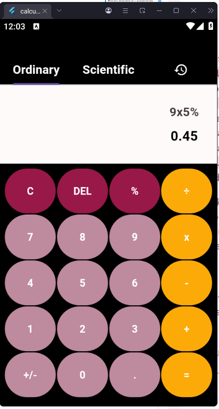
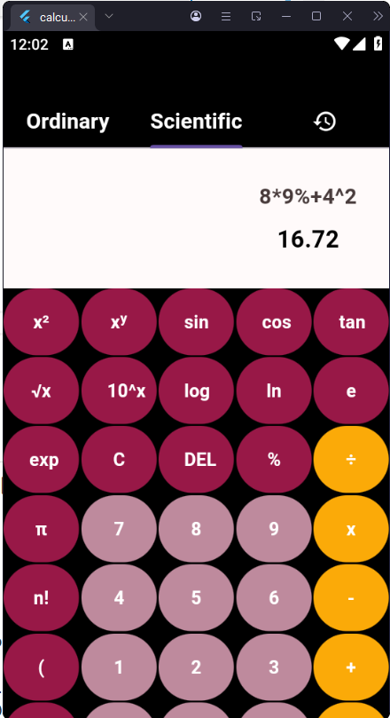
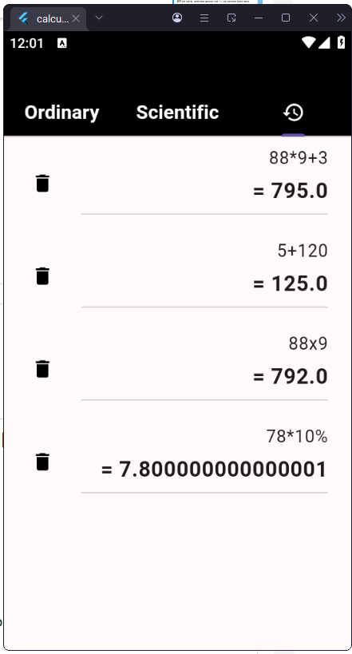

# 📱 Flutter Calculator App  

A sleek and powerful **Flutter-based calculator** with both **basic** and **scientific** modes.  
Built with clean UI, context-aware operations (like `%`), and a persistent history feature.  

---

## ✨ Features  
- 🔢 Basic & Scientific modes  
- 🧮 Context-aware % operator  
- 🕒 History tab with Shared Preferences  
- 🎨 Clean tabbed design  

---

## 📸 Screenshots  

  
  
  

