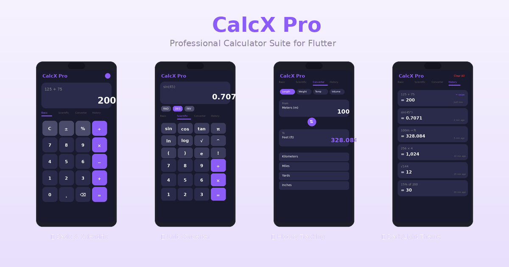
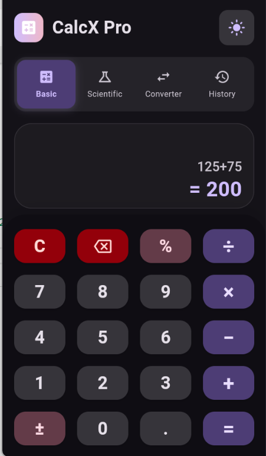
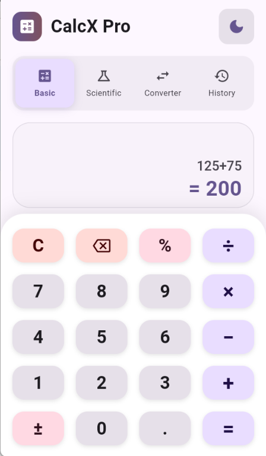
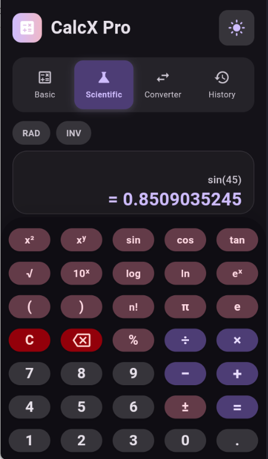
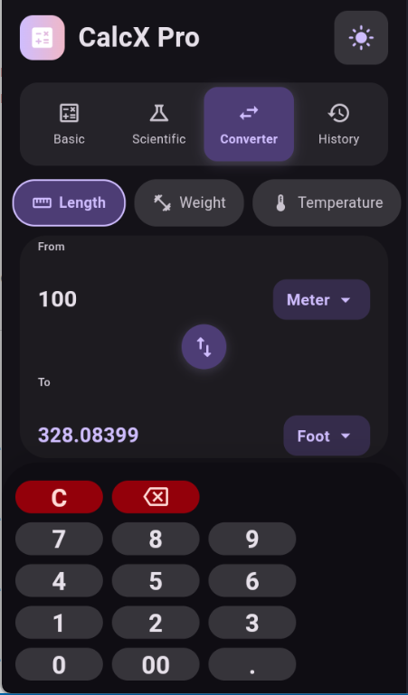

# CalcX Pro 🧮

A feature-rich, beautifully designed calculator app built with Flutter. Includes basic & scientific calculators, unit converter, and calculation history with Material 3 design.



## ✨ Features

| Feature | Description |
|---------|-------------|
| **Basic Calculator** | Standard arithmetic with percentage, sign toggle, and decimal support |
| **Scientific Mode** | Trigonometric, logarithmic, exponential functions with RAD/DEG modes |
| **Unit Converter** | 8 categories: Length, Weight, Temperature, Volume, Area, Speed, Time, Data |
| **History** | Persistent calculation history with swipe-to-delete and copy support |
| **Theming** | Dark/Light theme toggle with system preference detection |

## 📱 Screenshots

<p align="center">
  
  
  
  
</p>

## 🛠️ Tech Stack

- **Framework:** Flutter 3.x
- **State Management:** Provider
- **Storage:** SharedPreferences
- **Math Engine:** math_expressions
- **Design System:** Material 3

## 🚀 Getting Started

```bash
# Clone the repository
git clone https://github.com/yourusername/calcx-pro.git

# Navigate to project
cd calcx-pro

# Install dependencies
flutter pub get

# Run the app
flutter run
```

## 📂 Project Structure

```
lib/
├── main.dart                 # App entry point & navigation
├── providers/
│   └── theme_provider.dart   # Theme state management
├── screens/
│   ├── basic_calculator.dart # Basic calculator UI
│   ├── scientific_calculator.dart
│   ├── converter_screen.dart # Unit converter
│   └── history_screen.dart   # Calculation history
├── widgets/
│   └── calculator_button.dart # Reusable button components
└── utils/
    ├── calculator_engine.dart # Math & conversion logic
    └── shared_prefs_helper.dart
```

## 🎯 Key Implementations

**Expression Parser** — Custom tokenization engine supporting PEMDAS order of operations and context-aware percentage calculations.

**Unit Conversion System** — Base-unit architecture enabling accurate conversions across 8 categories with special handling for temperature formulas.

**Animated UI Components** — Custom button widgets with scale animations and haptic feedback for enhanced user experience.

## 📄 License

MIT License — feel free to use this project for learning or as a portfolio piece.

---

<p align="center">
  Built with ❤️ using Flutter
</p>